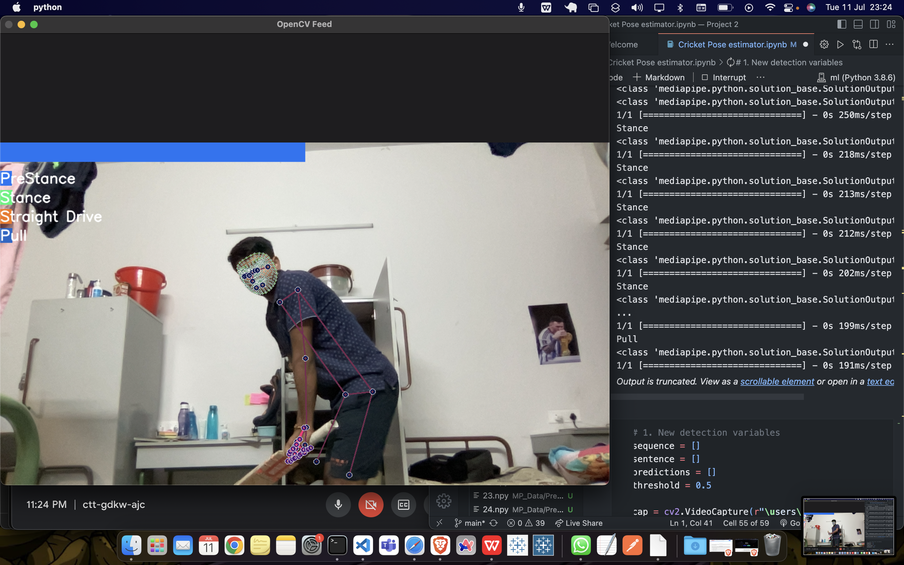

<h1>CRICKET POSE MODELLING</h1>

Inspiration - My teammate and I, both of us are fond of Cricket. And while watching an IPL match there was a clip of cricketers practising
their shots. We noticed the importance of postures while playing any shot. How sometimes the players might stretch a nerve if their posture gets a bit wrong.
It is crucial for them to keep a good posture while playing any shot. This project is a simple classification of the posture 
  while playing a shot. The classification covers postures like pre-stance, stance, pull and straight drive. 

 

 The project aims at giving an accurate result about what is the posture of the person standing in front of the camera. This will 
help the cricket enthusiasts to practice their shots and also correct themselved if they are not standing in the correct posture for the desired shot.

<h4>Dataset</h4>
The dataset has been prepared by me and my friends and it covers almost all the possible positions of the shot. Moreover, anytime this model
is used, the images that will be clicked for the prediction will automatically be added in the dataset, helping us achieve a larger and 
diverse dataset.
<h4>Model Description</h4>
The model has used modules like MediaPipe, OpenCV, TensorFlow, Numpy ans SciPy.  
In order to train the dataset and classify the images, we have used Long Short Term Memory (LSTM) algorithm.

<h4>Output</h4>

